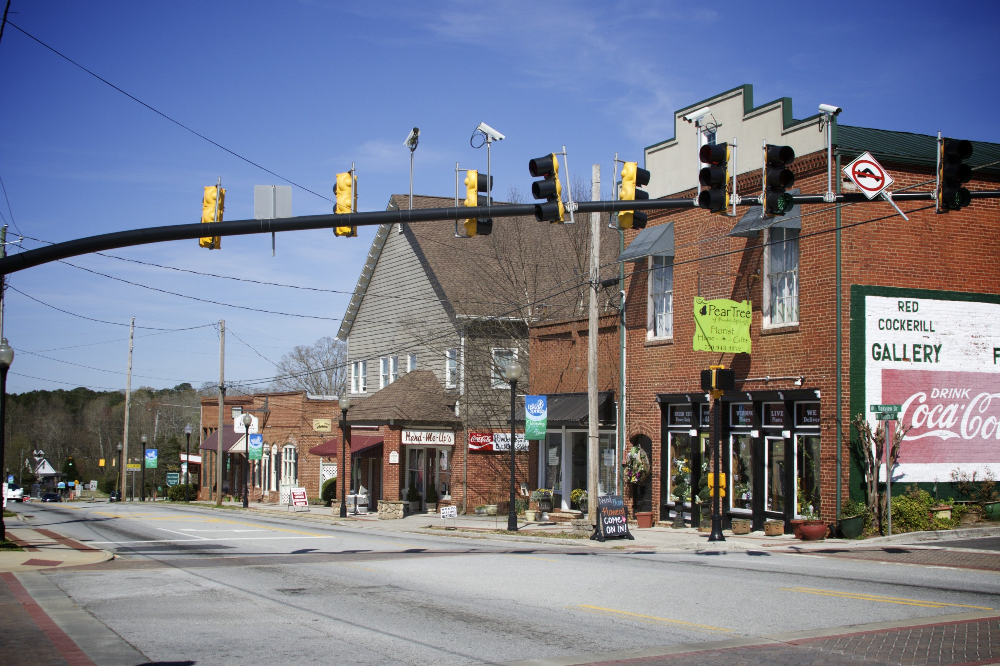
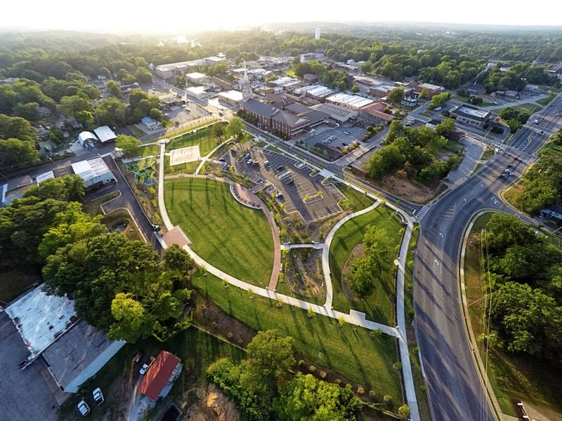
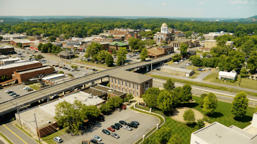

A ACP [(Advanced Care Partners)](https://www.advancedcarepartners.com/) é uma empresa de home care Americana atendendo famílias a mais de 8 anos em todo Estado da Georgia, sendo sua sede na cidade de Atlanta. Este ano, através da ACP Brasil, abre oportunidades de emprego para enfermeiros do Brasil que queiram fazer parte da família ACP na Georgia/EUA.

Se você tem o sonho de melhorar a sua qualidade de vida e a da sua família trabalhando como enfermeiro nos Estados unidos, saiba um pouco mais sobre as cidades de atuação da ACP, alguma delas pode se tornar o seu local de trabalho e de moradia algum dia.

### Um pouco mais sobre a Geórgia

Esse estado conta com belezas naturais espetaculares e nele você encontrará desde cidades com uma vida urbana intensa e uma noite movimentada até os litorais tranquilos e perfeitos para relaxar depois de uma semana de trabalho. Foi aqui também o cenário de um grande sucesso do cinema “E o Vento Levou”.

É um dos estados que mais cresce em termos populacionais: só entre 1990 e 2000, a população cresceu em 26%, saindo de pouco menos de 6,5 milhões de habitantes para mais de 8 milhões.

Falando agora especificamente de Atlanta, região metropolitana do estado no qual se localiza a sede da ACP, é uma cidade na qual é possível ver claramente o retorno dos impostos pagos pelos seus habitantes. O sistema de metrô é incrível e te leva para qualquer lugar, as ruas estão sempre limpas e também possui um dos maiores aquários do mundo.

<!-- FIXME Denis: criar um shortcode pra essas imagens usando pipes pra processar -->

    

O estado segue o sistema de educação americano. Antes de chegar ao ensino superior, os alunos cursam 12 anos de estudos, passando pela escola primária e secundária. Se você tem filhos pequenos, poderá fazer uso de um ensino de qualidade e gratuito.

### Sobre outras cidades de atuação da ACP

#### Powder Springs

    

Fica localizada no Condado de Cobb e conta com uma população de mais de 15 mil habitantes. O clima da cidade costuma ser quente e abafado no verão e, durante o inverno, que é curto, é bastante fresco e com chuvas. A temperatura média anual varia de 2º a 31º, assim, ficará fácil se adaptar.

#### Lawrenceville

    

Outra cidade no estado da Geórgia na qual a ACP atua com o home care. A população local é 100% urbana, contando em 2014, com mais de 30 mil habitantes. A renda familiar anual do local de acordo com um levantamento em 2016 é de US$ 45.133 ou de R$ 167.154,55. Lá você também encontra casas para comprar com valores compatíveis aos ganhos anuais.

#### Cartersville

    

Uma cidade pequena, com pouco quase 30 mil habitantes, Cartersville é o local ideal para quem gosta de qualidade de vida, segurança e tranquilidade. É uma cidade perfeita para a família, possuindo diversas opções de lazer para todas as idades.

Há muitas outras cidades da Geórgia nas quais a ACP atua e necessita constantemente de enfermeiros para cuidados no home care. Há, inclusive, diversas vagas abertas para as quais você pode se candidatar cumprindo todos os requisitos necessários.

Quer saber mais sobre como você pode morar em uma das cidades da Geórgia e ter uma qualidade de vida melhor trabalhando como enfermeiro? [Entre em contato com a gente e tire todas as suas dúvidas!]()


